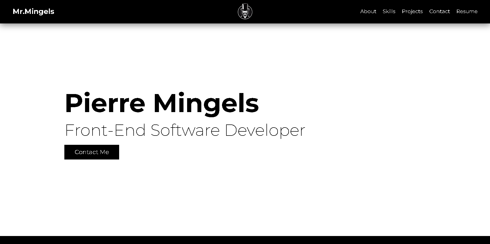

### **[Portfolio Website](https://portfolio-website-two-navy.vercel.app/)**

## **Project Introduction:**

Welcome to the repository of my personal portfolio website. This site is designed to showcase my technical skills, professional projects, and provide insight into my background and experience in the field of software development

Built with the power of React, the website is organized as a Single Page Application (SPA) which provides a seamless browsing experience. From the landing page, users can smoothly navigate to any section of the website using the navbar, with options including 'About Me', 'Projects', 'Skills', 'Resume', and 'Contact Me'. This is made possible by leveraging the capabilities of the React Router library

Through its modern and responsive design, the website ensures an engaging user experience across all devices. The CSS-based animations add a dynamic touch that elevates the overall look and feel of the site

## **About The Project:**

My portfolio website is a single-page application showcasing my skills, projects, and professional information to potential employers and collaborators

The common functionalities are:

- The user can smoothly scroll down to any section of the site by clicking on one of the options in the navbar
- On the 'About Me' section, the user can learn more about my personal background
- In the 'Skills' section, the user can view the skills that I possess. These are depicted in three separate categories: Technical Skills, Tools and Technologies, and Soft Skills
- In the 'Projects' section, the user can see a list of the projects that I've worked on. Each project has a description, and include links to visit the project's website or to view the source code
- In the 'Contact' section, the user can send me a message directly from the website. This form validates the user's input and displays error messages if the input is not valid. Upon successful submission, a message is displayed to the user
- In the 'Resume' section, the user can view an image of your resume directly on the website
- A 'PDF' button is provided for users to view a PDF version of your resume
- In the 'Resume' section, there's a dedicated 'Links' section. Here, users can access the websites of my projects, access the corresponding GitHub repositories, send me an email, and visit my GitHub profile

### **Built With:**

- React.js

- JavaScript (ES6+)

- HTML/CSS

### **Key Concepts:**

- Intersection Observer API

- Resume Display

- CSS Animations

- EmailJS

- Responsive Design

- Project Showcasing